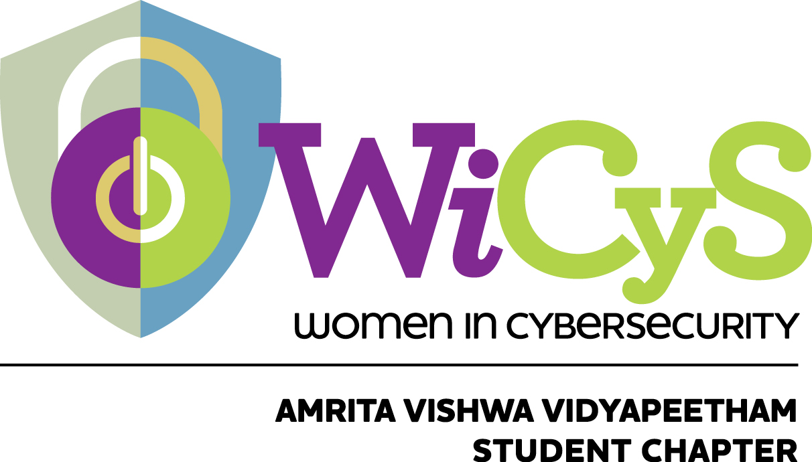

  

# Ramaguru Radhakrishnan's Works and Collaboration 

[Ramaguru's](https://ramagururadhakrishnan.github.io/) work in Amrita School of Engineering / Computing, Coimbatore, as M.Tech Cyber Security Student, Research Associate, Ph.D Research Scholar & Assistant Professor.

## Academic - Teaching Responsibility

#### Class Advisor of B.Tech CSE (Cyber Security): [2022 - 2026 Batch](https://github.com/re-bin-d-22ucys)

### Courses Offered

#### Present

| Year | Batch and Semester | Subject Code | Subject Name | 
|:-----|:------------------:|:------------:|:-------------|
| 2025-26 Even | 25PALE - II Sem | 24AL733  | [Connected Vehicles and Security](https://github.com/Amrita-TIFAC-Cyber-Blockchain/2025_24AL733_Connected_Vehicles_and_Security) |
| 2025-26 Even | 23UCYS - VI Sem | 24CYS333  | [Internet of Things](https://github.com/Amrita-TIFAC-Cyber-Blockchain/2025_24CYS333-Internet-of-Things) |
| 2025-26 Odd | 25UCYS - I Sem | 22AVP103 | [Mastery Over Mind](https://github.com/Amrita-TIFAC-Cyber-Blockchain/2025_22AVP103-Mastery-Over-Mind) |

#### Completed

| Year | Batch and Semester | Subject Code | Subject Name | 
|:-----|:------------------:|:------------:|:------------|
| 2025-26 Odd | 25PCYS - I Sem | 25AVP501 | [Mastery Over Mind](https://github.com/Amrita-TIFAC-Cyber-Blockchain/2025_25AVP501-Mastery-Over-Mind) |
| 2025-26 Odd | 24UEngg - III Sem | 23LIV390  | [Live-in-Labs® I](https://github.com/Amrita-TIFAC-Cyber-Blockchain/23LIV390-Live-in-Labs-I) |
| 2025-26 Odd | 22UCYS - VII Sem | 20CYS402  | [Distributed Systems and Cloud Computing](https://github.com/Amrita-TIFAC-Cyber-Blockchain/2025_20CYS402-Distributed-Systems-and-Cloud-Computing) |
| 2025-26 Odd | 22UCYS - VII Sem | 24CYS336 | [Blockchain Technology](https://github.com/Amrita-TIFAC-Cyber-Blockchain/2025_24CYS336-Blockchain-Technology) |
| 2024-25 Even | 22UCYS - VI Sem | 24CYS333  | [Internet of Things](https://github.com/Amrita-TIFAC-Cyber-Blockchain/2024_24CYS333-Internet-of-Things) |
| 2024-25 Even | 24PALE - II Sem | 24AL733  | [Connected Vehicles and Security](https://github.com/Amrita-TIFAC-Cyber-Blockchain/2024_24AL733_Connected_Vehicles_and_Security) |
| 2024-25 Odd | 21UCYS - VII Sem | 20CYS402 | [Distributed Systems and Cloud Computing](https://github.com/Amrita-TIFAC-Cyber-Blockchain/2024_20CYS402-Distributed-Systems-and-Cloud-Computing) |
| 2024-25 Odd | 22UCYS - V Sem | 19ENV300 | [Environmental_Science](https://github.com/Amrita-TIFAC-Cyber-Blockchain/19ENV300_Environmental_Science)
| 2024-25 Odd | 23UCYS - III Sem | 19CSE201 | [Advanced-Programming](https://github.com/Amrita-TIFAC-Cyber-Blockchain/2024_19CSE201-Advanced-Programming) | 
| 2023-24 Even | 21UCYS - VI Sem | 20CYS312 | [Principles of Programming Languages](https://github.com/Amrita-TIFAC-Cyber-Blockchain/20CYS312_Principles_of_Programming) |
| 2023-24 Even | 22UCYS - IV Sem | 20CYS383 | [Java Programming Lab](https://github.com/Amrita-TIFAC-Cyber-Blockchain/2024_20CYS383-Java-Programming-Lab) |
| 2023-24 Odd | 20UEEE/UELC/UCCE/UECE - VII Sem | 19CSE447 | [Cloud Computing](https://github.com/Amrita-TIFAC-Cyber-Blockchain/2023_19CSE447-Cloud-Computing) |
| 2023-24 Odd | 22UCYS - III Sem | 19CSE201 | [Advanced Programming](https://github.com/Amrita-TIFAC-Cyber-Blockchain/19CSE201-Advanced-Programming) |
| 2022-23 Even | 22UCYS - II Sem | 20CYS113 | [Computer Programming](https://github.com/Amrita-TIFAC-Cyber-Blockchain/20CYS113-20CYS181-Computer-Programming-and-Lab) |
| 2022-23 Even | 22UCYS - II Sem | 20CYS181 | [Computer Programming Lab](https://github.com/Amrita-TIFAC-Cyber-Blockchain/20CYS113-20CYS181-Computer-Programming-and-Lab) |
| 2022-23 Even | 21UCYS - IV Sem | 20CYS383 | [Java Programming Lab](https://github.com/Amrita-TIFAC-Cyber-Blockchain/2023_20CYS383-Java-Programming-Lab) |
| 2022-23 Odd | 21UCYS - III Sem | 20CYS202 | [User Interface Design](https://github.com/Amrita-TIFAC-Cyber-Blockchain/20CYS202-User-Interface-Design) |
| 2022-23 Odd | 21PCYS - III Sem | 21CY712 | [Blockchain Technology](https://ramagururadhakrishnan.github.io/teaching/2022-21CY712-BlockchainTechnology) |
| 2022-23 Odd | 19UEEE/UELC - VII Sem | 19CSE447 | [Cloud Computing](https://github.com/Amrita-TIFAC-Cyber-Blockchain/2022_19CSE447-Cloud-Computing) |
| 2021-22 Even | 19UECE/UCCE - VI Sem | 19CSE464 | [Fundamentals of Software Engineering](https://github.com/Amrita-TIFAC-Cyber-Blockchain/19CSE464-Fundamentals-of-Software-Engineering) |
| 2021-22 Odd | 20PCYS - III Sem | 20CY712 | [Blockchain Technology](https://ramagururadhakrishnan.github.io/teaching/2021-20CY712-BlockchainTechnology) |
| 2020-21 Odd | 19PCYS - III Sem | 18CY712 | [Blockchain Technology](https://ramagururadhakrishnan.github.io/teaching/2020-18CY712-BlockchainTechnology) |

## Research Responsibility

### Project Guidance

#### B.Tech - Computer Science (Cyber Security)

| Batch - Year |  Name | Dissertation Title | 
|:------------:|:------------|:------------|
| 2025-26   22UCYS | Meera N  Nedurumalli Vedvarshith Reddy   Kolluru Sai Supraj   Amita Narayanan Kutty |  [Simulation Based Cyber Security Awareness and Training Tool](https://github.com/amrita-tifac-cys-btech/Simulation-Based-Cyber-Security-Awareness-and-Training-Tool) |  
| 2025-26   22UCYS | Lalitha K   Parthiv Kumar Nikku   Pillimetla Vamsi   Saride Someswara Sai Sri Chakri |  [Exploring Data Diodes for Cyber Physical System Security](https://github.com/amrita-tifac-cys-btech/Exploring-Data-Diodes-for-Cyber-Physical-System-Security) |  
| 2024-25   21UCYS | Aishwarya G   Alagu Soundarya G   Deepthi G   S Adhwaith   Suvetha DP   Yaswanth G |  [Application-Aware Clipboard Security Using Configurable Policy Rules](https://github.com/amrita-tifac-cys-btech/Application-Aware-Clipboard-Security-Using-Configurable-Policy-Rules) |  
| 2024-25   21UCYS | Abinesh G   Anu Priya P   Pranav SR   Sanjai Prashad S   | [Port Watch Dog: Real-Time Port Scan Detection and Response Tool](https://github.com/amrita-tifac-cys-btech/Port-Watch-Dog-Real-Time-Port-Scan-Detection-and-Response-Tool) |  

#### M.Tech - Cyber Security

| Batch - Year |  Name | Dissertation Title | 
|:------------:|:------------|:------------| 
| 2025-26   24PCYS | Rangineny Sai Kiran | [Multi-Layer Framework for GPS Spoofing Detection in Civilian Platforms]()  | 
| 2023-24   22PCYS | Surya S Nair | [Aviation Cyber Security](https://github.com/Amrita-TIFAC-Cyber-Blockchain/Aviation-Cyber-Security)  |
| 2023-24   22PCYS | Siriparapu Sparshika | [V2I Authentication](https://github.com/Amrita-TIFAC-Cyber-Blockchain/V2X-Security) |
| 2022-23   21PCYS | Khandagale Swapneel Roasheb | [MeRiT: Media Tracking Platform to Tackle Online Piracy using AWS Rekognition](https://github.com/Amrita-TIFAC-Cyber-Blockchain/MeRiT-Media-Tracking-Platform-to-Tackle-Online-Piracy-using-AWS-Rekognition) |
| 2022-23   21PCYS | Mohamed Feroz Khan D | [Blockchain Forensics using OSINT and Temporal Graph Visualization](https://github.com/Amrita-TIFAC-Cyber-Blockchain/Blockchain-Forensics-using-OSINT-and-Temporal-Graph-Visualization) |
| 2022-23   21PCYS| Pothuri Lakshmi Harika | [Bridging the gaps in Solidity Smart Contract Vulnerability Detection Tools](https://github.com/Amrita-TIFAC-Cyber-Blockchain/Bridging-the-gaps-in-Solidity-Smart-Contract-Vulnerability-Detection-Tools) |
| 2021-22   20PCYS | Danda Prudhvi Krishna | [SSH-DAuth: Secret Sharing based Decentralized OAuth using Decentralized Identifier](https://github.com/Amrita-TIFAC-Cyber-Blockchain/SSH-DAuth-Secret-Sharing-based-Distributed-OAuth-using-Decentralized-Identifier) |
| 2021-22   20PCYS | Pradeep Kumar G | [Vehicular Forensics](https://github.com/Amrita-TIFAC-Cyber-Blockchain/Vehicular-Forensics) |

## Administrative Responsibility

<table>
  <tr>
    <td style="border: none;">
      <strong><a href="https://iic.cb.amrita.edu/">Institution's Innovation Council (IIC)</a></strong> 
    </td>
    <td style="border: none; text-align: center;">
      
    </td>
  </tr>
 <tr>
  <tr>
    <td style="border: none;">
      <strong><a href="https://github.com/CybeReach">CybeReach</a></strong> 
     One-stop cyber locale to complement an individual’s digital health and a progressively safer space.
    </td>
    <td style="border: none; text-align: center;">
      
    </td>
  </tr>
 <tr>
    <td style="border: none;">
      <strong><a href="https://github.com/WiCyS-Amrita">WiCyS Amrita Student Chapter</a></strong> 
     To provide a gender-diverse space to explore the world of Cyber Security by engaging through   mentoring, conferences, and cine analysis. Aspire women in the STEM
    </td>
    <td style="border: none; text-align: center;">
      
    </td>
  </tr>
 <tr>
    <td style="border: none;">
      <strong><a href="https://github.com/B-RIG">Blockchain - Research Interest Group (B-RIG)</a></strong> 
     A vibrant community for developing socio-economic applications using Blockchain Technology.
    </td>
    <td style="border: none; text-align: center;">
      
    </td>
  </tr>
 <tr>
    <td style="border: none;">
      <strong><a href="https://github.com/KOLECT-Amrita">KOLECT</a></strong> 
      Knowledge Connect Platform
    </td>
    <td style="border: none; text-align: center;">
      
    </td>
  </tr>
  <tr>
    <td style="border: none;">
      <strong><a href="https://amrita.toastmastersclubs.org/">Amrita Toastmasters Club (ATC)</a></strong> 
    </td>
    <td style="border: none; text-align: center; vertical-align: middle;">
      
    </td>
  </tr>
    <tr>
    <td style="border: none;">
      <strong><a href="">Amrita - Model United Nations Society (A-MUNSO)</a></strong> 
    </td>
    <td style="border: none; text-align: center; vertical-align: middle;">
      
    </td>
  </tr>
</table>
